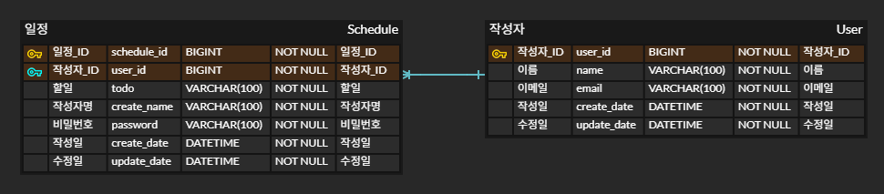
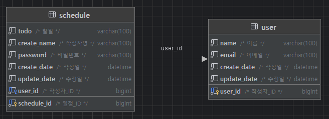

# 📅 schedule-app
내일배움캠프 - 일정 관리 앱

## 🐾 프로젝트 소개
schedule-app은 CRUD 기반의 일정 관리 앱입니다.

이 프로젝트를 통해 데이터베이스 설계, SQL 쿼리 작성, API 명세, 페이지네이션, 예외 처리, 유효성 검증 등 백엔드 개발의 핵심 역량을 실습합니다.

## 📌 주요 기능
- 일정 CRUD (생성, 조회, 수정, 삭제)

Lv 1. 일정 생성 및 조회<br>
Lv 2. 일정 수정 및 삭제<br>
Lv 3. 연관 관계 설정<br>
Lv 4. 페이지네이션<br>
Lv 5. 예외 발생 처리<br>
Lv 6. null 체크 및 특정 패턴에 대한 검증 수행

## 📑 API 명세서
아래 링크를 통해, 각 Method에 대한 요구사항 및 URL, Request, Response, 상태코드를 확인할 수 있습니다.

[API 명세서](https://documenter.getpostman.com/view/44733463/2sB2jAaTZM)

## 🗂️ ERD



## ✅ 요구사항
### 1️⃣ 필수 기능
Lv 0. API 명세 및 ERD 작성
- [x] API 명세서 작성하기
- [x] ERD 작성하기
- [x] SQL 작성하기

Lv 1. 일정 생성 및 조회
- [x] 일정 생성(일정 작성하기)
  - `AUTO_INCREMENT` 으로 각 일정의 고유 식별자(ID)를 자동으로 생성하여 관리
  - `LocalDateTime.now()` 으로 날짜와 시간을 저장함
- [x] 전체 일정 조회(등록된 일정 불러오기)
  -  `Date`(YYYY-MM-DD)으로 같은 날짜 일정을 확인함
  - `ORDER BY update_date DESC` 으로 내림차순 정렬 조회
- [x] 선택 일정 조회(선택한 일정 정보 불러오기)
  - `schedule_id`를 사용하여 조회함

Lv 2. 일정 수정 및 삭제
- [x] 선택한 일정 수정
  - `UPDATE schedule SET update_date = NOW()` 으로 수정일 갱신
- [x] 선택한 일정 삭제
  - `DELETE FROM schedule WHERE schedule_id = ? AND password = ?` 으로 비밀번호와 id가 맞아야 삭제됨

### 2️⃣ 도전 기능
Lv 3. 연관 관계 설정
- [x] 작성자와 일정의 연결
  - 작성자 생성 후 일정 생성하면서 작성자와 연결함

Lv 4. 페이지네이션
- [x] 한 페이지당 나타낼 데이터를 지정
  - `Pageable pageable = PageRequest.of(page, size)`으로 보여줄 데이터 범위를 지정함
  - 쿼리문에 `LIMIT ? OFFSET ?` 추가하여 적용
  - 범위를 넘어선 페이지를 요청하는 경우 빈 배열을 반환 
 
Lv 5. 예외 발생 처리
- [x] HTTP 상태 코드와 에러 메시지를 포함한 정보를 사용하여 예외를 관리
  - `@ExceptionHandler`와 `@RestControllerAdvice`으로 공통 예외 처리 구현
  - 예외 처리 경우 : 입력값이 없거나 조건에 맞지 않을 때, 식별자나 비밀번호를 잘못 입력하여 데이터를 찾지 못할 때

Lv 6. null 체크 및 특정 패턴에 대한 검증 수행
- [x] 유효성 검사
  - `@NotBlank`으로 필수값 처리
  - `@Size(max = 200)`으로 최대 200자 이내로 제한
  - `@Email`로 이메일 형식에 맞는지 확인

## 📁 프로젝트 구조

```
schedule-app/
├── src/
│   ├── main/
│   │   ├── java/
│   │   │   └── com/example/scheduleapp/
│   │   │       ├── controller/
│   │   │       │   └── ScheduleController.java
│   │   │       ├── dto/
│   │   │       │   ├── request/
│   │   │       │   │   ├── ScheduleDeleteRequestDto.java
│   │   │       │   │   ├── SchedulePatchRequestDto.java
│   │   │       │   │   └── SchedulePostRequestDto.java
│   │   │       │   └── response/
│   │   │       │       └── ScheduleResponseDto.java
│   │   │       ├── entity/
│   │   │       │   ├── Schedule.java
│   │   │       │   └── User.java
│   │   │       ├── exception/
│   │   │       │   ├── GlobalExceptionHandler.java
│   │   │       │   └── NotFoundScheduleException.java
│   │   │       ├── repository/
│   │   │       │   ├── schedule/
│   │   │       │   │   ├── JdbcTemplateScheduleRepository.java
│   │   │       │   │   └── ScheduleRepository.java
│   │   │       │   └── user/
│   │   │       │       ├── JdbcTemplateUserRepository.java
│   │   │       │       └── UserRepository.java
│   │   │       └── service/
│   │   │           ├── schedule/
│   │   │           │   ├── ScheduleService.java
│   │   │           │   └── ScheduleServiceImpl.java
│   │   │           └── user/
│   │   │               ├── UserService.java
│   │   │               └── UserServiceImpl.java
│   │   └── resources/
│   │       ├── application.properties
│   │       ├── static/
│   │       └── templates/
│   └── test/
│       └── java/
│           └── com/example/scheduleapp/
├── build.gradle
├── schedule.sql
├── readme/
└── README.md
```